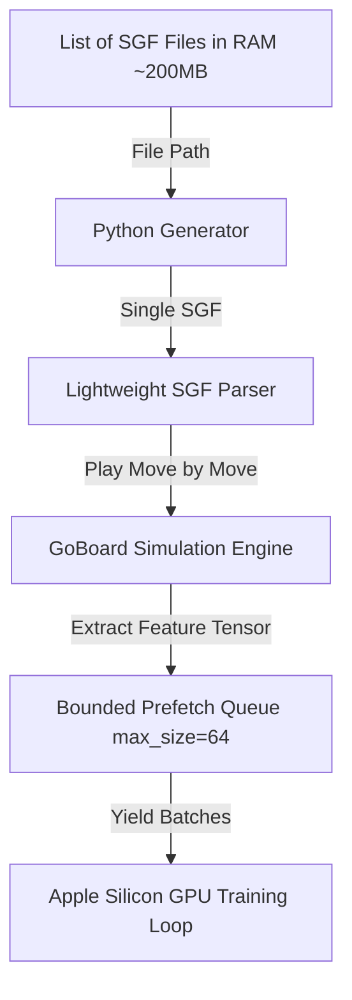

# How can we design a memory-efficient SGF parsing pipeline with Python generators?

## Context
When preparing to train Go models on human games (Supervised Fine-Tuning), loading and parsing tens of thousands of SGF files to generate training features can lead to a massive RAM footprint (exceeding 10 GB), especially as we scale to $19 \times 19$ boards. We need a memory-efficient, high-throughput pipeline.

## Answer

### 1. The Memory Bottleneck of Traditional Datasets
A standard training pipeline pre-calculates and loads the entire dataset of states into RAM. For 50,000 games on a $19 \times 19$ board:
- Average game length: 150 moves.
- Total positions: $50,000 \times 150 = 7,500,000$ positions.
- Feature tensor representation (e.g., 18 channels of $19 \times 19$ binary planes): $19 \times 19 \times 18 \text{ bits/bytes} \approx 6.5 \text{ KB}$ per position.
- Total raw feature size: $7.5 \times 10^6 \times 6.5 \text{ KB} \approx 48.7 \text{ GB}$ of uncompressed float/binary data.

Storing this entire dataset in RAM is impossible on most local development machines or standard GPU nodes without causing out-of-memory (OOM) errors.

### 2. The Generator-Based Pipeline Architecture
Instead of loading all features, we load only the raw SGF text files (typically $\approx 200 \text{ MB}$ total for 50,000 games) or paths into memory, and process them dynamically using an on-the-fly Python generator combined with multi-threaded prefetching.



#### Step A: SGF Indexing
We maintain a list of file paths (and optionally game offsets) in memory. This list takes negligible space (under 1 MB).

#### Step B: On-The-Fly Generation
A Python generator reads the SGF files sequentially, parses each game, reconstructs the game state move-by-move on a single `GoBoard` instance, and yields the corresponding features:

```python
def sgf_generator(file_paths, board_size=19):
    for path in file_paths:
        with open(path, 'r') as f:
            sgf_content = f.read()
        game = parse_sgf_string(sgf_content)
        board = GoBoard(board_size)
        for move in game.moves:
            # Yield inputs (features) and labels (move, final game outcome)
            features = board.to_features()
            target_move = move.to_index(board_size)
            winner = game.winner  # +1 for Black, -1 for White
            yield features, target_move, winner
            board.play_move(move)
```

#### Step C: Bounded Queue & Prefetching
To prevent the CPU-bound game simulation from bottlenecking the GPU training loop, we run the generator inside a background worker thread/process.
1. The background worker fetches items from the generator, groups them into batches, and puts them into a bounded queue (`queue.Queue(maxsize=64)`).
2. Because the queue is bounded (`maxsize=64`), the worker thread will block and pause once the queue is full.
3. This guarantees that at any given moment, we store at most $64$ batches of tensors in RAM.
4. **RAM Footprint**: The memory footprint is capped at under **500 MB**, regardless of whether the dataset contains 10,000 or 1,000,000 games.
