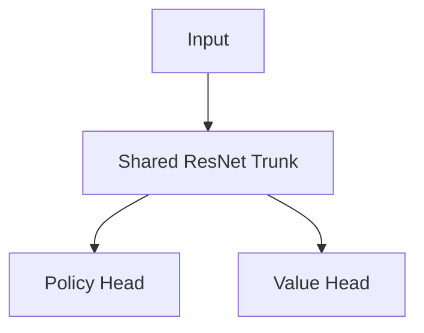

# Preventing Reinforcement Learning Representation Collapse under Playout Cap Randomization (PCR)

## Context
During Attempt 9 training, we transitioned to running 100% of self-play games under Playout Cap Randomization (PCR) to meet the 2-hour iteration time budget. This raised questions about whether enabling PCR would re-trigger the representation collapses and PASS attractor loops observed in earlier attempts (e.g., Attempts 5 and 6), and how our current architectural design prevents these failures.

## Answer
In earlier attempts, enabling PCR or running low-simulation self-play games caused the model to collapse (yielding a 0% win rate against random agents). This collapse was not a fundamental flaw of the PCR concept itself, but rather a vulnerability in the model's architecture and action space boundaries that PCR exposed. 

Our current architecture prevents representation collapse under PCR through three distinct structural mechanisms:

### 1. Trunk Representation Decoupling (Option A Stop-Gradient)
In a standard AlphaZero ResNet, the trunk weights are shared and updated by gradients from both the policy prior head and the value outcome head:



When training on noisy low-simulation games, the value head target (game outcome) becomes heavily corrupted by tactical blunders. In a shared-weight model, the backpropagated gradients from these corrupted value targets alter and corrupt the shared trunk features, destroying the policy representation (leading to value-head blindness).

To cure this, we implemented **Option A Trunk Decoupling**, inserting `mx.stop_gradient` between the shared trunk and the value head:

```python
# From src/autogo_mlx/model.py
class SizeInvariantGoResNet(nn.Module):
    def __call__(self, x: mx.array, mask: mx.array, return_score: bool = False):
        # 1. Forward pass through shared trunk
        trunk_feats = self.trunk(x)
        
        # 2. Policy head uses trunk features directly
        policy_logits = self.policy_head(trunk_feats, mask)
        
        # 3. Stop-gradient isolates the trunk from value head updates
        value_feats = mx.stop_gradient(trunk_feats)
        value_out = self.value_head(value_feats)
        ...
```

By blocking value gradients from flowing back into the shared ResNet trunk, the core representations remain stable and are driven purely by the cleaner policy target.

---

### 2. The Move 60 PASS Legal Gate
In Attempts 5 and 6, the model collapsed because the value head learned that passing early in the game was a safe attractor (e.g., if White fell slightly behind, it would `PASS` on Move 1, resulting in a feedback loop where the model learned only how to pass).

We cured this by restricting the pass action to late plies (Move 60+). During the vectorized self-play MCTS evaluation callback, the `PASS` move is legally pruned:

```python
# From src/autogo_mlx/gameplay.py
# Legally restrict PASS to ply >= 60 to prevent the behavioral PASS attractor collapse
if state.move_count() >= 60:
    legal_actions_nn = legal_flat + [pass_index]
else:
    legal_actions_nn = legal_flat
```

This prevents the model from generating premature double-pass game records and keeps all self-play games competitive and strategic.

---

### 3. PCR Regularization Dynamics
PCR works by evaluating 15% of moves in every game with high simulations (128 sims) and 85% of moves with low simulations (16 sims). 
* **Guideposts**: The 15% high-simulation steps act as tactical guideposts that steer the game trajectory away from early blunders.
* **Regularization**: The 85% low-simulation moves act as a regularizer, preventing the policy head from over-optimizing to specific search trees and forcing the model to generalize.
* **Stable Targets**: Because the game trajectories remain strategically sound, the final game outcomes (used as value head targets) remain clean and highly representative of true Go play.
