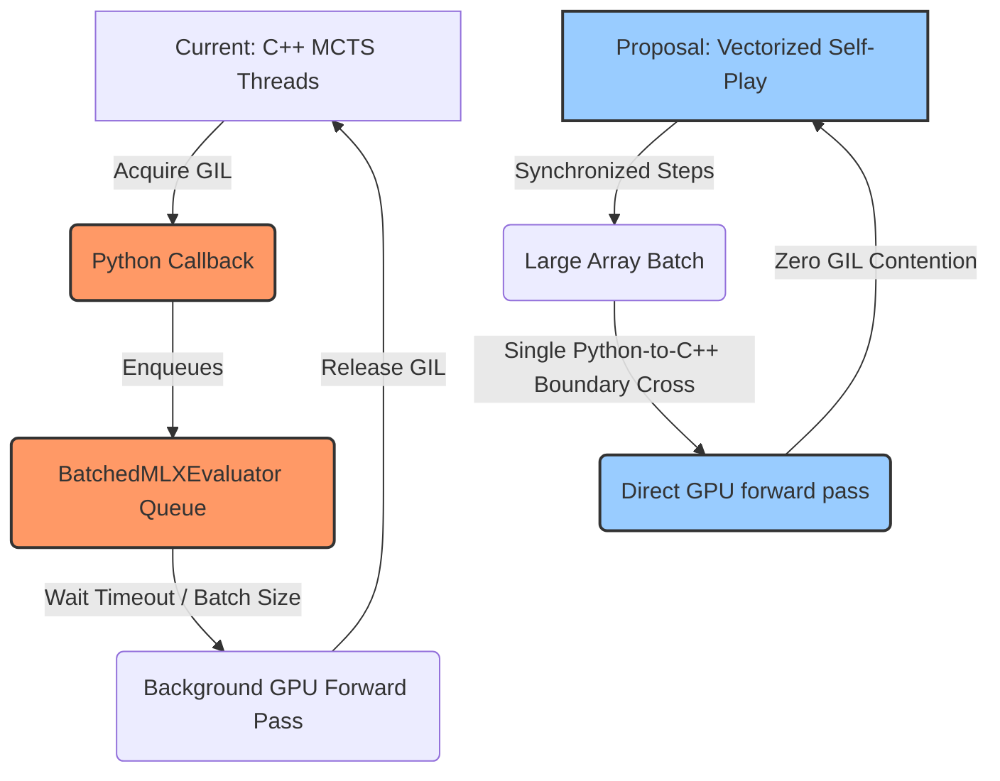

# Autogo MLX RL Selfplay: Analysis & Improvement Proposals

Following a thorough review of the overnight multi-iteration Reinforcement Learning run (which ran for 12 iterations from scratch on Apple Silicon producing a highly converged `iter12` model that secured a **99.0%** win rate against the random agent), we have analyzed the bottleneck structure and convergence characteristics of the pipeline.

While the RL loop was a massive success, the entire pipeline is constrained by **collection throughput**. Over **94.5%** of the 24.22-hour total runtime was spent collecting games (averaging ~1.8 hours per iteration of 1000 games), while model training took only ~7.5 minutes per iteration. Bypassing or optimizing this bottleneck will unlock vastly deeper searches, larger models, and faster iterations.

Below is a structured suite of high-impact improvement proposals grouped by category.

---

## 🏎️ 1. Breakthrough Performance & Self-Play Throughput

### 🚨 The GIL Callback Bottleneck
In the current implementation, C++ `MCTSTree` multithreading is used to parallelize tree exploration, but it relies on a Python callback (`batched_evaluator_cb`) to execute the neural network forward pass via MLX. 
* **The issue**: When C++ threads trigger a Python callback, they must acquire the Python **Global Interpreter Lock (GIL)**. This serializes a significant portion of the search tree traversal, causing thread contention, CPU cores idling, and sub-optimal GPU pipeline saturation (as shown by a very low peak GPU memory under 200 MB).

### 💡 Proposed Solutions:



#### A. Synchronous Vectorized Self-Play (Batching across Games)
Instead of running 8 gameplay threads, each playing a sequential game from start to finish, implement **synchronized vectorized gameplay**:
* Run a batch of games (e.g., 64, 128, or 256 games) step-by-step simultaneously in a single main thread.
* During the MCTS exploration step, gather all states needing evaluation across **all active games** into a single massive tensor.
* Execute a single compiled MLX forward pass (`mx.eval`) on the entire batch.
* This completely eliminates Python threads, locks, queue timeouts (`timeout_ms=1.0`), and GIL contention, maximizing Unified Memory bandwidth and fully loading the Apple Silicon Neural Engine or GPU.

#### B. Direct C++ Native Inference (Bypassing Python Entirely)
Move the neural network evaluator entirely into C++ to bypass the Python layer:
* Compile/load the model weights natively using the **MLX C++ API** (`mlx-c`) or compile the model to CoreML/ONNX and load it using ONNX Runtime C++ inside the C++ game engine.
* The C++ `MCTSTree` can directly run inferences on the GPU without crossing the C++ $\rightarrow$ Python boundary for leaf evaluation, unlocking a 10x-50x speedup in simulations/second.

#### C. Progressive MCTS Simulations
Early in the RL loop, the model is highly random (`iter0` to `iter5`). Spending 64 simulations/move on a weak network is extremely inefficient.
* **Proposal**: Anneal simulations progressively. Use 16 simulations for iterations 0–3, 32 for iterations 4–7, and 64+ for iteration 8+. This would slash initial iteration collection times from 2 hours to under 30 minutes.

---

## 🧠 2. Algorithmic Reinforcement Learning Enhancements

### A. League Training / Opponent Checkpoint Pool
Currently, self-play games are played exclusively between identical models (`iterN` vs `iterN`).
* **The Risk**: This is highly susceptible to **strategy collapse**, **catastrophic forgetting**, and **cyclic exploitation** (where the model develops a localized style that exploits its own current flaws but would lose to simpler diverse strategies).
* **Proposal**: Build an opponent pool. For each self-play game, select the opponent with:
  * 80% probability: the latest checkpoint `iterN`.
  * 20% probability: a randomly selected historical checkpoint (e.g., `iterN-3`, `iterN-6`, or a moving window of past checkpoints).
  * This ensures the agent maintains a robust global strategy and prevents regression.

### B. MCTS Gating / Model Acceptance Testing
Currently, the pipeline accepts the new checkpoint `iterN+1` unconditionally after training.
* **The Risk**: If an iteration overfits, experiences gradient explosion, or uses an unstable learning rate, the model quality collapses, and the pipeline starts collecting poor quality data using a broken model.
* **Proposal**: Implement a gating check.
  * Before updating the latest checkpoint for the next generation of self-play, play a 40-game evaluation match between the new candidate `iterN+1` and the current champion `iterN`.
  * Accept `iterN+1` only if it wins $\ge 55\%$ of the games (using standard search parameters).
  * If it fails, keep the champion `iterN`, but generate fresh training data or adjust hyperparameters (learning rate/weight decay) and retrain.

### C. Temperature & Exploration Annealing
In `collect.py`, the temperature is kept static at `1.0` throughout the game:
* **The Risk**: High temperature at the end of the game leads to blunders, creating low-quality dataset states where the model learns from bad end-game choices.
* **Proposal**: Implement **temperature annealing**:
  * Set `temperature = 1.0` for the first 10 moves to ensure high opening variety.
  * Decay the temperature to `0.1` or `0.0` (argmax play) for the remainder of the game to ensure high-quality, tactically sound mid-game and end-game records.

---

## 📐 3. Feature & Network Architecture Improvements

### A. Deeper Input Feature Planes (Expanding beyond 8 channels)
The current model utilizes 8 input channels (one-hot board status + liberty planes + Ko point). While this is highly effective, Go models benefit significantly from history features:
* **Proposal**: Implement an 18-channel input space:
  * **Channels 0-15**: 8-ply history of stone configurations (8 planes for the current player's historical stones, 8 planes for the opponent's historical stones). This allows the network to natively capture situational Ko, superko rules, and board progression dynamics without manual feature engineering.
  * **Channel 16**: Color to play (all ones if Black, all zeros if White).
  * **Channel 17**: Liberty or tactical indicators.

```
Input Frame (B, H, W, 18)
├── [0-7]   Current Player's Stone History (t, t-1, ... t-7)
├── [8-15]  Opponent's Stone History (t, t-1, ... t-7)
├── [16]    Current Player Color Plane (1s or 0s)
└── [17]    Ko Indicator Plane
```

### B. Auxiliary Territory / Score Regression Head
Currently, the value head predicts only binary win/loss probability (`[0, 1]`) using Binary Cross BCE.
* **The Issue**: In variable or close games, a binary win/loss signal provides high-variance gradients.
* **Proposal**: Add a second regression head to the model that predicts the **final territory score difference** (margin of victory, e.g. +3.5 or -12.5).
  * Train this head using Mean Squared Error (MSE) against the actual final score of the self-play game.
  * This auxiliary task guides the internal representations of the residual blocks to track stone counts, influence, and territory borders, leading to faster tactical convergence.

---

## 📊 Summary of Recommendations

| Priority | Improvement | Complexity | Expected Impact |
| :--- | :--- | :--- | :--- |
| **P0** | **Vectorized Self-Play or C++ Native Inference** | High | 🚀 **10x - 20x faster self-play iterations** |
| **P0** | **Progressive MCTS Simulations** | Low | 🚀 **50% total runtime reduction** |
| **P1** | **Temperature & Dirichlet Noise Annealing** | Low | 🎯 Higher tactical quality, faster convergence |
| **P1** | **Opponent Checkpoint Pool (League)** | Medium | 🛡️ Immune to strategy collapse / cycles |
| **P2** | **Score Prediction auxiliary head** | Medium | 📈 Better policy gradients, faster training |
| **P2** | **Multi-ply History Input (18 Channels)** | Medium | 🧠 Native representation of situational Ko / Superko |
