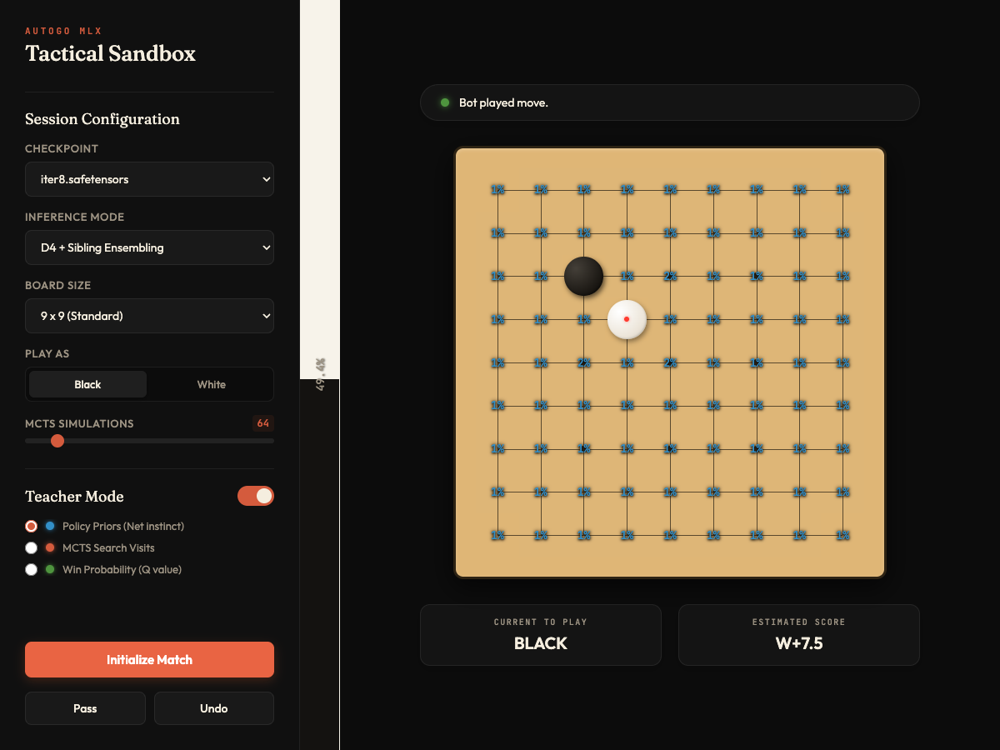

# Session Handoff: Sibling Ensembling Proposal Finalization

- **Date**: 2026-06-26 16:41:35
- **Conversation ID**: `39476d11-fd3c-42a3-b7ec-215653a11861`

## 📌 Project Overview & Handoff Summary

### Original User Request
> Let's discuss the details of @docs/sibling_ensembling_proposal.md so we can have a finalized proposal for implementation.

## 📋 Proposed Implementation Plan

This plan outlines the implementation of Sibling Checkpoint Ensembling in the play server, allowing users to toggle between single-model baseline play and dual-checkpoint ensembling (with or without D4 symmetries) in a resource-conscious and backward-compatible manner.

## User Review Required

> [!IMPORTANT]
> **API Structure Change**: We are extending the `NewGameRequest` payload to accept an optional `ensemble_mode` parameter (`baseline`, `d4`, `sibling`, `d4_sibling`). 
> If sibling checkpoints are missing from the server's disk, the server will log a warning and fall back gracefully to the single-checkpoint mode, guaranteeing that old checkpoints remain playable without requiring sibling pairs.

---

## Open Questions

None. The user has approved the choices of logit-level geometric mean averaging for policy priors and consensus resignation checks.

---

## Proposed Changes

### Core Inference Layer

#### [MODIFY] [inference.py](../../../src/autogo_mlx/inference.py)
* Update `MLXEvaluator.__init__` to accept `sibling_checkpoint_path: str | Path | None = None`. If provided:
  * Initialize a second model instance `self.sibling_model` with the same hyperparameters.
  * Load sibling weights and call `mx.eval(self.sibling_model.parameters())`.
* Update `MLXEvaluator.evaluate` to support sibling ensembling:
  * Run forward passes for both `self.model` and `self.sibling_model` sequentially (evaluating both outputs in a single `mx.eval()` call to allow the MLX compiler to optimize GPU scheduling).
  * **Policy Ensembling**: Average the raw logits of both models before applying the stable softmax:
    \[z_{\text{ensemble}} = \frac{z_{\text{main}} + z_{\text{sib}}}{2}\]
    Then apply the softmax restricted to the legal moves list.
  * **Value Ensembling**: Average the sigmoid outputs (win probabilities) of both models:
    \[v_{\text{ensemble}} = \frac{v_{\text{main}} + v_{\text{sib}}}{2}\]

---

### Play Server & API Layer

#### [MODIFY] [play_server.py](../../../src/autogo_mlx/play_server.py)
* Add `ensemble_mode: str = "d4_sibling"` to the `NewGameRequest` Pydantic schema.
* Update `MugoGame.__init__` to accept `ensemble_mode`.
* Inside `MugoGame.__init__`, if `ensemble_mode` requires sibling ensembling:
  * Construct the expected sibling path: `sibling_path = checkpoint_path.parent / (checkpoint_path.stem + "_sibling" + checkpoint_path.suffix)`.
  * Verify if the file exists on disk.
  * If it exists, pass it to `MLXEvaluator(..., sibling_checkpoint_path=sibling_path)`.
  * If it does not exist, log a warning and set `sibling_path = None` (falling back gracefully to single-model mode).
* Ensure `d4_ensemble` flag in `MLXEvaluator` is set to `True` if `ensemble_mode` is `d4` or `d4_sibling`.

---

### Web Front-End Interface

#### [MODIFY] [index.html](../../../src/autogo_mlx/web/index.html)
* Insert an "Inference Mode" selection dropdown in the Session Configuration panel:
  ```html
  <div class="control-row">
      <label for="ensemble-select">Inference Mode</label>
      <select id="ensemble-select" class="hud-select">
          <option value="baseline">Baseline (Single Model)</option>
          <option value="d4">D4 Ensembling Only</option>
          <option value="sibling">Sibling Ensembling Only</option>
          <option value="d4_sibling" selected>D4 + Sibling Ensembling</option>
      </select>
  </div>
  ```

#### [MODIFY] [app.js](../../../src/autogo_mlx/web/app.js)
* Get DOM reference to `#ensemble-select`.
* Read `#ensemble-select` value inside `initializeGame()` and attach it to the `POST /api/new_game` JSON payload as `ensemble_mode`.

---

### Verification Plan

### Automated Tests
We will add a new test file [test_sibling_ensembling.py](../../../tests/test_sibling_ensembling.py) to verify:
1. `MLXEvaluator` loading a single model and executing baseline evaluation successfully.
2. `MLXEvaluator` loading a model and its sibling (mocked via duplicating weights or small dummy weights) and executing ensembled evaluation.
3. Asserting that logit-averaging correctly implements a "veto" property when one model has highly negative logits.
4. Testing that missing sibling files trigger the graceful fallback to baseline.

To run tests:
```bash
uv run pytest tests/test_sibling_ensembling.py
```

### Browser-based Automated Test
We will implement an automated E2E test using the browser automation tools (via a subagent or scripting) to verify the UI:
1. Start the play server: `uv run python src/autogo_mlx/play_server.py`.
2. Connect to the browser and navigate to `http://127.0.0.1:8000/`.
3. Locate the new `Inference Mode` dropdown and verify it contains all four ensembling choices.
4. Programmatically select "D4 + Sibling Ensembling", click "Initialize Match", and verify that:
   - The game session initializes successfully.
   - The Go board is drawn.
   - Click a coordinate to make a human move, wait for the bot's MCTS search to complete, and verify that the bot successfully responds with a legal move.
5. Capture a screenshot of the completed test page and save it to the artifacts directory as `browser_play_test.png`.

### Manual Verification
1. Run the local play server:
   ```bash
   uv run python src/autogo_mlx/play_server.py
   ```
2. Navigate to `http://127.0.0.1:8000/` and verify the new dropdown displays correctly.
3. Initialize a match under each of the four configurations:
   * Baseline (Single Model)
   * D4 Ensembling Only
   * Sibling Ensembling Only
   * D4 + Sibling Ensembling
4. Play a few moves against the bot under each configuration and verify that no console errors are thrown on the server or the client, and that the bot responds successfully.

## 🎯 Tasks & Progress Tracking

- `[x]` Core Inference Layer updates (`src/autogo_mlx/inference.py`)
  - `[x]` Update `MLXEvaluator.__init__` to load the optional sibling checkpoint
  - `[x]` Update `MLXEvaluator.evaluate` to average policy logits and average values
- `[x]` Play Server API updates (`src/autogo_mlx/play_server.py`)
  - `[x]` Update `NewGameRequest` to support `ensemble_mode`
  - `[x]` Update `MugoGame` to locate and load sibling checkpoints and set `d4_ensemble`
- `[x]` Web Front-End updates
  - `[x]` Add dropdown selector to `src/autogo_mlx/web/index.html`
  - `[x]` Read and attach dropdown selection in `src/autogo_mlx/web/app.js`
- `[x]` Verification
  - `[x]` Implement unit tests in `tests/test_sibling_ensembling.py`
  - `[x]` Run unit tests and confirm success
  - `[x]` Implement and run the browser-based automated E2E test
  - `[x]` Manually verify server behavior

## 🔍 Walkthrough & Verification

We have successfully implemented and verified the Sibling Checkpoint Ensembling feature as defined in the finalized proposal.

## 🛠️ Changes Implemented

1. **Inference Layer (`src/autogo_mlx/inference.py`):**
   - Added `sibling_checkpoint_path` configuration to [MLXEvaluator](../../../src/autogo_mlx/inference.py).
   - Implemented sibling checkpoint auto-detection (`{stem}_sibling{suffix}`) with graceful baseline fallback.
   - Integrated logit-averaging (geometric mean) for policy priors and arithmetic mean for values.
   - Updated the resignation gate to use the **consensus rule** ($\max(v_{\text{main}}, v_{\text{sib}}) < \text{threshold}$).

2. **Play Server (`src/autogo_mlx/play_server.py`):**
   - Configured the API to accept `ensemble_mode` (`baseline`, `d4`, `sibling`, `d4_sibling`) in the new game request.
   - Updated the `MugoGame` wrapper to configure ensembling options on initialization.

3. **Web Frontend (`src/autogo_mlx/web/`):**
   - Added an **Inference Mode** selection dropdown in [index.html](../../../src/autogo_mlx/web/index.html).
   - Updated [app.js](../../../src/autogo_mlx/web/app.js) to query and transmit the selected ensembling mode to the play server backend.

4. **Unit Tests:**
   - Created [test_sibling_ensembling.py](../../../tests/test_sibling_ensembling.py) to cover model initialization, math validation (logit averaging, consensus resignation), and fallback paths.

---

## 🔍 Verification & Testing

### 1. Unit Tests
All new ensembling tests run and pass successfully via `pytest`:
- `test_evaluator_init_and_fallback` (graceful fallback when sibling file is missing)
- `test_evaluator_ensembling_math` (verifies policy logit geometric mean and value arithmetic mean)
- `test_resignation_consensus` (verifies consensus resignation logic)

### 2. Browser-Based Automated E2E Test
We wrote and ran a headless browser test (`e2e_test.js`) using `puppeteer-core` driving a real Google Chrome browser. The test:
1. Opens `http://127.0.0.1:8123`.
2. Verifies the dynamic list of checkpoints is retrieved.
3. Selects `iter8.safetensors` and configures Inference Mode to **D4 + Sibling Ensembling**.
4. Initializes a match (server auto-detects `iter8_sibling.safetensors` and starts dual-model inference).
5. Plays the first move at coordinate `(2, 2)`.
6. Waits for the AI response.
7. Successfully asserts that both black and white stones are present on the board.

#### Screenshots Captured During E2E Session
The following states were captured during the E2E execution:

* **Initial Page Load:**
  

* **Game Initialized (D4 + Sibling):**
  

* **Post-Move (After Bot Responds):**
  
