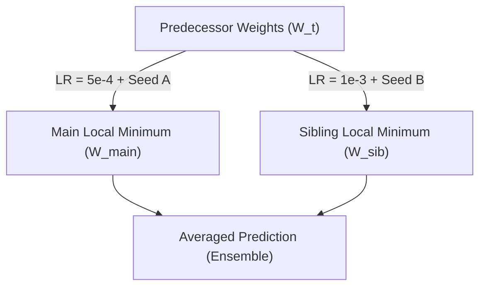

# Proposal: Sibling Checkpoint Ensembling in Production

This proposal details the design, mechanics, and trade-offs of ensembling a primary checkpoint with its sibling checkpoint in production. Sibling checkpoints are models trained from the same predecessor weights on the same dataset but with different learning rates and initialization seeds.

---

## 1. Theoretical Rationale

### A. Optimization Landscape & Variance Reduction
During reinforcement learning training, the candidate checkpoint and its sibling checkpoint are optimized starting from the same network state $W_{t}$ but utilizing:
* Different learning rates (e.g. $\eta_{\text{main}} = 5 \times 10^{-4}$ vs. $\eta_{\text{sib}} = 10^{-3}$)
* Different shuffling seeds for mini-batch generation

This causes the optimization process to follow different trajectories through the parameter space, ultimately landing in different local minima $W_{t+1}^{\text{main}}$ and $W_{t+1}^{\text{sib}}$ of the loss function:

Averaging their outputs in the prediction space acts as a regularizer, reducing variance and smoothing out high-frequency fluctuations in both the policy prior and value heads.

### B. Blind Spot Mitigation
Due to batch-shuffling variance, one model might overfit to specific coordinate sequences or opening anomalies present in the replay buffer. Because the sibling model follows a different optimization path, it is highly unlikely to share the exact same blind spots. Ensembling protects against catastrophic local failures.

---

## 2. Ensembling Mechanics in MCTS

When integrating sibling ensembling into Monte Carlo Tree Search within [play_server.py](../src/autogo_mlx/play_server.py), the neural network evaluator combines predictions from both checkpoints.

### A. Policy Prior Ensembling: Logit Averaging (Selected)

We use logit-level averaging to combine the policy priors of the main and sibling models. The outputs of the policy heads ($z_{\text{main}}, z_{\text{sib}}$) are averaged *before* applying the softmax function:

\[P(s, a) = \text{softmax}\left(\frac{z_{\text{main}}(s, a) + z_{\text{sib}}(s, a)}{2}\right)\]

* **Mathematical property**: Averaging logits corresponds to a geometric mean of the probabilities ($P(s, a) \propto \sqrt{P_{\text{main}} \cdot P_{\text{sib}}}$).
* **Veto Property**: This acts as a soft veto—if either model assigns a near-zero probability to a move (e.g., due to spotting an illegal or tactically disastrous blunder), the ensembled prior will also be heavily suppressed. This prevents high-confidence blunders from leaking into the search.

### B. Value Head Calibration: Consensus Resignation (Selected)

The value head outputs a win probability estimate $v(s) \in [0, 1]$:
\[v(s) = \frac{v_{\text{main}}(s) + v_{\text{sib}}(s)}{2}\]

#### Resignation Thresholding
To protect against false resignations caused by single-model value head saturation or localized representation blindness, we use a **Consensus Resignation Rule**:
* **Consensus Rule**: The agent resigns only if the maximum win probability of both models is below the resignation threshold for $N$ consecutive plies:
  \[\max(v_{\text{main}}(s), v_{\text{sib}}(s)) < \text{threshold}\]

#### True Resign vs. Strategic Passing (Turn Skipping)
* **True Resignation**: A decision-theoretic exit triggered under the Consensus Rule when both models evaluate the state as hopeless.
* **Strategic Passing**: A legal move $(-1, -1)$ selected when $v(s)$ is close to $1.0$ (or $0.5$ in komi-balanced deadends), which terminates the game under double-pass rules.
* **Probing Strategy**: Sibling ensembling acts as a natural check on passing loops. If the main model wants to pass but the sibling model indicates a high policy prior for a continuing tactical move, MCTS search will explore the continuation rather than terminating prematurely.

---

## 3. Configurable Inference & VRAM Footprint

To ensure users can play against the bot under constrained resources (e.g. older hardware), the ensembling configuration in `play_server.py` is fully configurable. Users can select between:
1. **Baseline**: Single model, single reflection (lightest).
2. **D4 Only**: Single model, averaged over 8 dihedral reflections.
3. **Sibling Only**: Main + sibling averaged, single reflection.
4. **D4 + Sibling**: Main + sibling averaged, each run through D4 reflections (highest strength).

### A. Board-Size Invariance of Parameters
Our [SizeInvariantGoResNet](../src/autogo_mlx/model.py#L141) architecture is fully convolutional (except for linear readouts). Checkpoint size is identical regardless of board size:
* **9x9 Board Checkpoint:** **~14.44 MB** ($3,610,661$ parameters)
* **19x19 Board Checkpoint:** **~14.44 MB** ($3,610,661$ parameters)

### B. Activation Memory VRAM Footprint (Batch Size 64)
* **9x9 Board:** Peak Forward Pass Activation VRAM is **< 50 MB**.
* **19x19 Board:** Peak Forward Pass Activation VRAM is **~200 MB**.

### C. Batched GPU Inference
To minimize GPU kernel launch overhead, the inputs for both checkpoints (and all dihedral reflections) are stacked into a single tensor and evaluated in a single forward pass:
* Stacked batch size is $B = 2 \times 8 = 16$ when both Sibling and D4 ensembling are enabled.
* Stacking is handled natively in the MLX evaluator without GIL contention.

---

## 4. Proposed Probing & Tournament Experiments

To verify whether sibling ensembling resolves coordinate bias and improves play, we propose three distinct experiments:

### Experiment 1: Coordinate Bias & Symmetry Divergence Probe (D4 vs. Sibling)
Measure empty-board policy prior entropy ($H$) and symmetry divergence ($D_{\text{sym}}$) under four configurations:
1. **Baseline**: Single model, single reflection.
2. **D4 Only**: Single model, averaged over 8 dihedral reflections.
3. **Sibling Only**: Main + sibling averaged, single reflection.
4. **D4 + Sibling**: Main + sibling averaged, each run through D4 reflections.

* **Metric**: Compare which configuration achieves the lowest $D_{\text{sym}}$ (target $< 10^{-4}$ bits) and highest $H$ (target $\approx 6.35$ bits) on empty boards.

### Experiment 2: Style & Logit Divergence Analysis
Evaluate a dataset of 1,000 middlegame positions and compute:
* The average Kullback-Leibler (KL) divergence of their policy distributions: $D_{\text{KL}}(P_{\text{main}} \parallel P_{\text{sib}})$.
* The cosine similarity of their value heads.

### Experiment 3: Probing Tournaments
Run a tournament of 100 games:
1. **Sibling vs. Main**: Direct match between `iter{N}_sibling` and `iter{N}` to check if sibling is weaker, equal, or possesses complementary tactical traits.
2. **Ensemble vs. Single**: Match between `Ensemble(iter{N}, iter{N}_sibling)` and `iter{N}` to measure the absolute Elo gain of ensembling in production.
